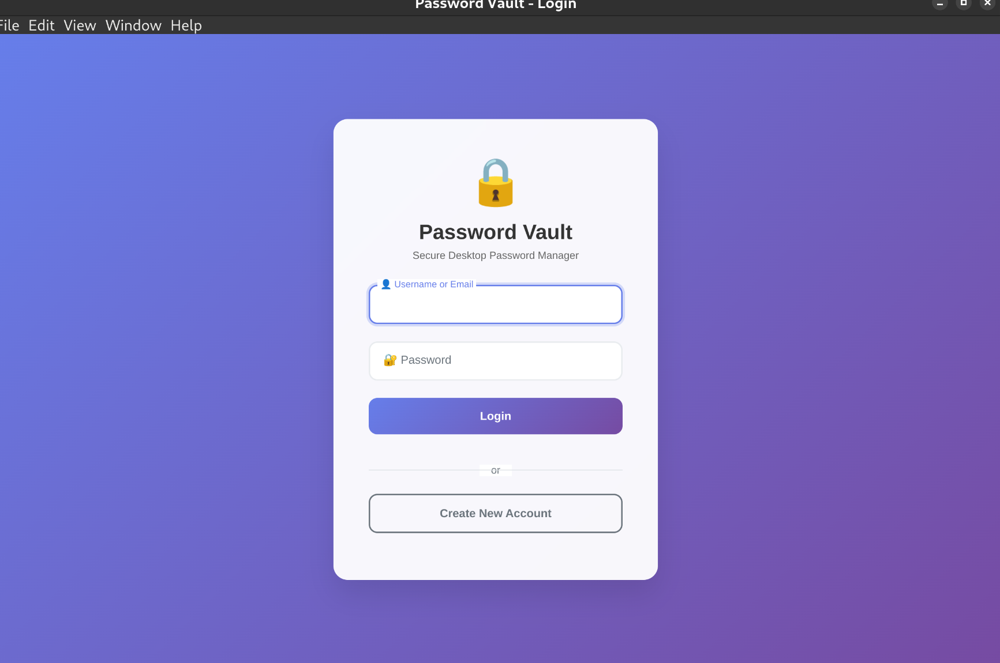
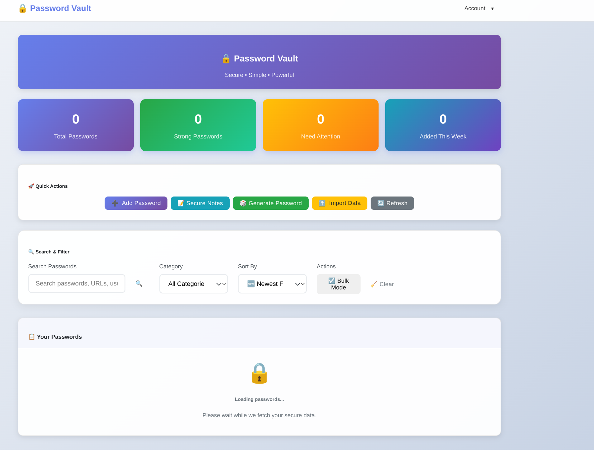

# Password Vault Desktop 🔐

A secure, modern desktop password manager built with **Electron**. This is a standalone desktop application with professional encryption, SQLite database, and optimized memory usage.

## ✨ Features

### 🖥️ Desktop-Native Experience
- **Standalone desktop application** - No browser or external dependencies required
- **Cross-platform support** - Linux, Windows, macOS
- **Native window controls** - Minimize, maximize, close buttons
- **System integration** - Desktop shortcuts and application menu
- **Keyboard shortcuts** - Full desktop-style shortcuts (Ctrl+N, Ctrl+F, etc.)
- **Desktop notifications** - Native system notifications

### 🔒 Enterprise-Grade Security
- **AES-256-CBC encryption** - Military-grade encryption for all passwords
- **Secure key management** - Automatic encryption key generation and storage
- **Bcrypt password hashing** - Secure user authentication
- **SQLite database** - Local, encrypted password storage
- **Memory protection** - Optimized for low memory usage
- **No network dependencies** - Fully offline operation

### 🎨 Modern UI
- **Professional interface** - Clean, modern desktop UI
- **Responsive design** - Works on any screen size
- **Dark/Light themes** - Multiple theme options
- **Advanced search** - Filter passwords by category, tags, favorites
- **Bulk operations** - Select and manage multiple passwords
- **Password generator** - Built-in secure password generation

### 🚀 Performance Optimized
- **Memory configuration** - Automatic memory optimization for different systems
- **Low memory mode** - Special mode for resource-constrained systems
- **Raspberry Pi support** - Runs on ARM devices
- **Fast encryption** - Optimized encryption/decryption algorithms
- **Efficient database** - SQLite with proper indexing

## 📸 Screenshots

### Login Page

*Secure login interface with modern design and gradient background*

### Home Dashboard

*Main password management interface with search, categories, and secure storage*

## 🚀 Quick Start

### Automated Installation

Use the automated build script (recommended):
```bash
chmod +x build-and-run.sh
./build-and-run.sh
```

This script will:
- Check if binaries exist
- Build them if needed
- Launch the application
- Handle all dependencies automatically

### Manual Installation

1. **Install prerequisites:**
   ```bash
   # Ubuntu/Debian
   sudo apt update && sudo apt install -y nodejs npm
   
   # Fedora/RHEL
   sudo dnf install -y nodejs npm
   
   # macOS
   brew install node
   ```

2. **Install dependencies:**
   ```bash
   npm install
   ```

3. **Build the application:**
   ```bash
   npm run build-linux    # Linux
   npm run build-win      # Windows
   npm run build-mac      # macOS
   ```

4. **Run the application:**
   ```bash
   # Linux AppImage
   ./dist/Password\ Vault-1.0.0.AppImage
   
   # Or from source
   npm start
   ```

## 📦 Available Binaries

After building, you'll find these files in the `dist/` directory:

### Linux
- **`Password Vault-1.0.0.AppImage`** (109MB) - Portable application, no installation required
- **`password-vault-desktop-1.0.0.tar.gz`** (104MB) - Archive format for manual installation
- **`password-vault-desktop_1.0.0_amd64.deb`** - Debian/Ubuntu package (if author email is configured)

### Windows
- **`Password Vault Setup 1.0.0.exe`** - Windows installer
- **`Password Vault-1.0.0.exe`** - Portable executable

### macOS
- **`Password Vault-1.0.0.dmg`** - macOS disk image
- **`Password Vault-1.0.0.zip`** - Zipped application

## 🛠️ Architecture

```
Password Vault Desktop (Pure Electron)
├── Main Process (electron/main.js)
│   ├── SQLite Database Management
│   ├── AES Encryption/Decryption
│   ├── User Authentication
│   ├── Window Management
│   └── IPC Communication
├── Renderer Process (electron/pages/)
│   ├── Login Interface (login.html)
│   ├── Dashboard Interface (dashboard.html)
│   ├── Password Management UI
│   └── Settings & Configuration
├── Preload Script (electron/preload.js)
│   ├── Secure API Bridge
│   └── Context Isolation
└── Memory Configuration (memory-config.js)
    ├── System Detection
    ├── Memory Optimization
    └── Performance Tuning
```

## 📁 Data Storage

All user data is stored in the system's user data directory:

### Linux
```
~/.config/password-vault-desktop/
├── passwords.db         # Encrypted password database
├── .secret.key         # Encryption key (32 bytes)
└── backups/            # Automatic backups
```

### Windows
```
%APPDATA%\password-vault-desktop\
├── passwords.db
├── .secret.key
└── backups\
```

### macOS
```
~/Library/Application Support/password-vault-desktop/
├── passwords.db
├── .secret.key
└── backups/
```

## 📋 Available Scripts

```bash
# Development
npm start                    # Start app in development mode
npm run dev                 # Start with developer tools
npm run start-lowmem        # Start in low memory mode
npm run start-pi           # Start in Raspberry Pi mode

# Building
npm run build              # Build for current platform
npm run build-linux       # Build Linux binaries
npm run build-win         # Build Windows binaries
npm run build-mac         # Build macOS binaries
npm run build-all         # Build for all platforms
./build_release.sh        # Professional build script

# Distribution
npm run dist              # Create distributable packages
npm run pack             # Create unpacked directory

# Testing
npm test                 # Run unit tests
npm run test-suite      # Run comprehensive test suite
node integration_test.js # Run integration tests

# Maintenance
./install_electron.sh    # Install/reinstall application
./uninstall_electron.sh # Uninstall application
./stop_electron.sh      # Stop running instances
```

## 🔧 Memory Configuration

The application automatically detects your system and optimizes memory usage:

### Automatic Detection
- **High-end systems** (8GB+ RAM) - Full features enabled
- **Mid-range systems** (4-8GB RAM) - Balanced optimization  
- **Limited systems** (<4GB RAM) - Aggressive memory savings
- **Raspberry Pi** - Ultra-low memory mode

### Manual Memory Modes
```bash
# Ultra-low memory (Raspberry Pi)
npm run start-pi

# Low memory mode
npm run start-lowmem

# Custom memory limit
./start_electron.sh --max-old-space-size=256
```

## 🛡️ Security Features

### Encryption
- **AES-256-CBC** - Industry-standard symmetric encryption
- **Random IV generation** - Unique initialization vector for each password
- **32-byte encryption keys** - Maximum security key length
- **Automatic key management** - Keys generated and stored securely

### Authentication
- **Bcrypt hashing** - Secure password hashing with salt
- **Account lockout** - Protection against brute force attacks
- **Session management** - Secure user session handling

### Data Protection
- **Local storage only** - No cloud dependencies or data transmission
- **Encrypted database** - All sensitive data encrypted at rest
- **Secure memory handling** - Passwords cleared from memory after use
- **Backup encryption** - Backups are fully encrypted

## 🐛 Troubleshooting

### Common Issues

#### 1. "Initialization Error: ENOENT, .secret.key not found"

**Cause:** This was a known issue with packaged applications where the encryption key couldn't be created.

**Solution:** This has been fixed in the current version. The app now uses the system's user data directory. If you still see this:

```bash
# Clear old data and restart
rm -rf ~/.config/password-vault-desktop/
./dist/Password\ Vault-1.0.0.AppImage
```

#### 2. "Could not locate the bindings file" (sqlite3)

**Cause:** Native sqlite3 bindings not compiled for your system.

**Solution:**
```bash
# Rebuild native dependencies
npm rebuild
# or
npm uninstall sqlite3 && npm install sqlite3@5.1.6
```

#### 3. AppImage won't run

**Cause:** Missing permissions or FUSE not available.

**Solution:**
```bash
# Make executable
chmod +x "./dist/Password Vault-1.0.0.AppImage"

# If FUSE issues on older systems
"./dist/Password Vault-1.0.0.AppImage" --appimage-extract-and-run
```

#### 4. Build fails with "Please specify author 'email'"

**Cause:** DEB package requires maintainer email.

**Solution:** This only affects .deb packages. AppImage and tar.gz still build successfully. To fix:
```bash
# Edit package.json
"author": "Your Name <your.email@example.com>"
```

#### 5. Out of memory errors

**Cause:** Insufficient RAM for normal mode.

**Solution:**
```bash
# Use low memory mode
npm run start-lowmem

# Or use Raspberry Pi mode for extreme cases
npm run start-pi
```

#### 6. Application won't start after update

**Cause:** Cached data conflicts.

**Solution:**
```bash
# Clear application cache
rm -rf ~/.config/password-vault-desktop/Cache/
rm -rf ~/.config/password-vault-desktop/GPUCache/

# Keep your passwords and settings:
# Do NOT delete: passwords.db, .secret.key
```

### Build Troubleshooting

#### 1. Node.js version issues
```bash
# Check version (needs 16+)
node --version

# Update Node.js if needed
curl -fsSL https://deb.nodesource.com/setup_18.x | sudo -E bash -
sudo apt-get install -y nodejs
```

#### 2. Native compilation fails
```bash
# Install build tools (Ubuntu/Debian)
sudo apt install -y build-essential python3-dev

# Install build tools (Fedora/RHEL)
sudo dnf groupinstall "Development Tools"
sudo dnf install python3-devel

# Clear and reinstall
rm -rf node_modules package-lock.json
npm install
```

#### 3. Electron download fails
```bash
# Set Electron mirror (China/slow connections)
export ELECTRON_MIRROR=https://npm.taobao.org/mirrors/electron/
npm install
```

### Performance Troubleshooting

#### Application starts slowly
1. Check system resources: `htop` or Task Manager
2. Try low memory mode: `npm run start-lowmem`
3. Close other applications to free RAM
4. Consider SSD if using mechanical hard drive

#### Database operations slow
1. Check database size: `ls -lh ~/.config/password-vault-desktop/passwords.db`
2. Vacuum database: Use built-in database maintenance tools
3. Clean old backups: Remove old `.vault` files

#### High memory usage
1. Monitor memory: `ps aux | grep password-vault`
2. Use memory profiler: Start with `--enable-logging`
3. Switch to ultra-low memory mode for Raspberry Pi

### Recovery Procedures

#### Forgot master password
Unfortunately, passwords cannot be recovered without the master password due to encryption. You'll need to:
1. Delete `~/.config/password-vault-desktop/passwords.db`
2. Restart application to create new account
3. Restore from backup if available

#### Corrupted database
```bash
# Backup current database
cp ~/.config/password-vault-desktop/passwords.db ~/passwords.db.backup

# Try SQLite recovery
sqlite3 ~/.config/password-vault-desktop/passwords.db ".recover" | sqlite3 recovered.db

# If recovery fails, restore from backup
# Backups are in ~/.config/password-vault-desktop/backups/
```

#### Lost encryption key
If `.secret.key` is deleted, passwords cannot be decrypted. Recovery options:
1. Restore `.secret.key` from system backup
2. Restore complete user data directory from backup
3. If no backup exists, database must be reset (data loss)

## 🔧 Development

### Setting up development environment
```bash
# Clone the repository
git clone <repository-url>
cd password-vault

# Install dependencies
npm install

# Start in development mode
npm run dev
```

### Running tests
```bash
# Run all tests
npm test

# Run integration tests
node integration_test.js

# Run security tests
node test_suite.js
```

### Building from source
```bash
# Build for your platform
npm run build

# Build for all platforms (requires setup)
npm run build-all
```

## 🆘 Getting Help

### Documentation
- Check built-in help system (F1 key in application)
- Read `INSTALLATION.md` for detailed setup instructions
- Check `TESTING.md` for testing procedures
- Review `RASPBERRY_PI_GUIDE.md` for ARM device setup

### Support Channels
- Create GitHub issue for bugs
- Check existing issues for solutions
- Join community discussions
- Read troubleshooting section above

### Security Issues
- Report security vulnerabilities responsibly
- Use private disclosure for sensitive issues
- Follow responsible disclosure practices

## 🎯 Pro Tips

### Performance
- Use AppImage for best performance (no extraction needed)
- Keep database under 10MB for optimal speed
- Use low memory mode on systems with <4GB RAM
- Enable automatic backups for data safety

### Security Best Practices
- Use a unique, strong master password (12+ characters)
- Enable automatic locking after inactivity
- Regularly backup your vault (automated backups available)
- Keep the application updated
- Don't store the master password anywhere else

### Productivity
- Learn keyboard shortcuts (Ctrl+N for new password)
- Use the built-in password generator
- Organize passwords with categories and tags
- Set up favorites for frequently accessed accounts
- Use bulk operations for managing multiple passwords

## 📈 System Requirements

### Minimum Requirements
- **RAM:** 2GB (4GB recommended)
- **Storage:** 500MB free space
- **OS:** Linux (Ubuntu 18.04+), Windows 10+, macOS 10.14+
- **CPU:** x64 processor (ARM64 supported)

### Recommended Requirements
- **RAM:** 4GB or more
- **Storage:** 1GB free space (for backups)
- **OS:** Latest stable versions
- **Display:** 1024x768 or higher

### Special Configurations
- **Raspberry Pi:** 1GB RAM minimum, use ultra-low memory mode
- **Older systems:** Use portable versions (AppImage/ZIP)
- **Enterprise:** Consider batch deployment scripts

---

## 🎉 Welcome to Password Vault Desktop!

You're now ready to secure your digital life with a professional-grade password manager. Start by creating your master password and gradually migrate your accounts to this secure system.

**Remember:** Your master password is the key to everything - make it strong and memorable! 